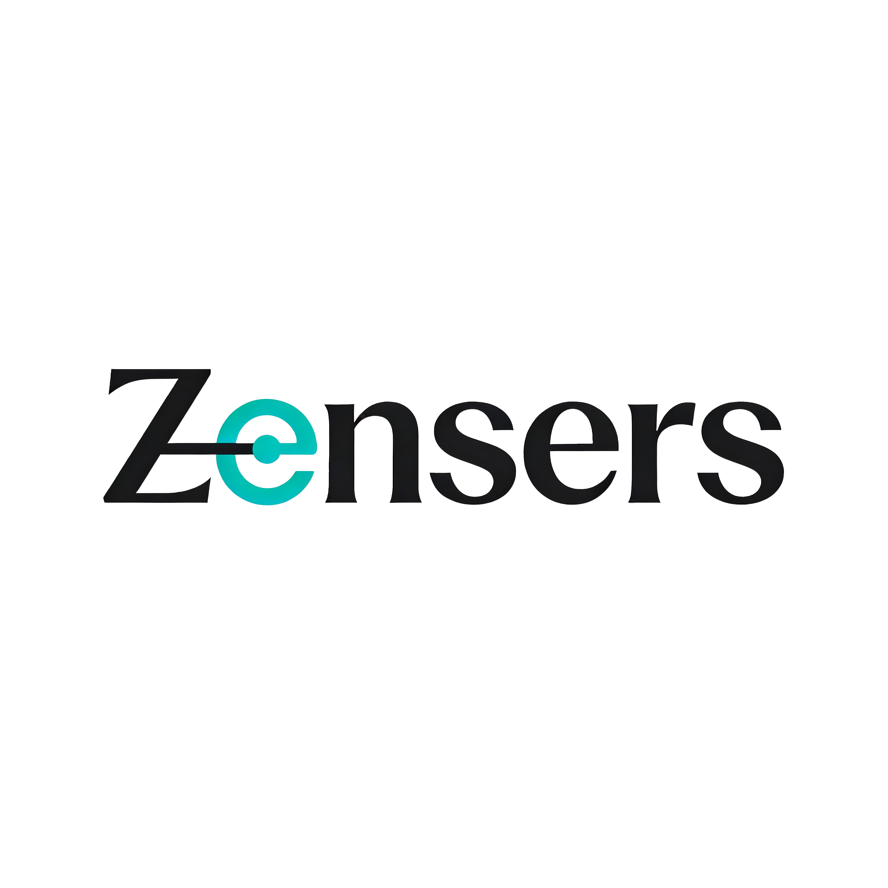

<div align="center">



# Zensers

**AI 驱动的自动化行业研究平台**

<br>

[](LICENSE)
[]()
[]()
[]()
[]()

<br>

> 多智能体协作，将研究问题转化为专业级研究报告 —— 每一个数据点都经过交叉验证。

[English](README_EN.md) · 快速开始 · [文档](docs/) · [路线图](docs/ROADMAP.md)

</div>

---

## 为什么选择 Zensers？

传统行业研究依赖分析师数周的手工工作：搜集数据、交叉验证、撰写报告。Zensers 将这一流程自动化 —— 不是简单的 LLM 包装器，而是一支由专业 Agent 组成的协作团队，从需求解析、数据采集、深度分析到质量校准，全流程自主完成。

**核心价值：**

| | |
|---|---|
| **10x 效率提升** | 数周的研究工作压缩至数小时，从需求到成品报告一键生成 |
| **数据可信** | 多源交叉验证 + 来源白名单 + 事实溯源，宁可标注不确定也不传播错误 |
| **专业级输出** | 麦肯锡风格排版，10 种专业图表，DOCX/PPTX/PDF/Markdown 多格式导出 |
| **持续进化** | 双轨学习系统（Wisdom + Knowledge），每次研究都让系统更聪明 |

---

## 核心能力

### 多智能体协作系统

Zensers 编排一支专业 Agent 团队，每个 Agent 负责研究流程中的关键环节：

```
需求解析 → 智能澄清 → 意图分析 → 任务分解 → 并行执行 → 结果聚合 → 质量校准 → 文档生成
```

| Agent | 职责 |
|-------|------|
| RequirementAnalysisAgent | 行业识别、维度分析、深度评估、技能推荐 |
| DataCollectionAgent | 多源搜索、数据清洗、API 调用、文件解析 |
| CrossSynthesisAgent | 跨领域综合、矛盾检测、逻辑整合 |
| ReportGenerationAgent | 内容整合、结构组织、风格统一、摘要生成 |
| QualityCheckAgent | 数据准确性、内容完整性、逻辑连贯性、格式规范 |
| ResultCalibrationAgent | 结果校准、数据修补、质量收敛 |
| DocumentGenerationAgent | Word/PPT/PDF/HTML 多格式专业排版输出 |
| SurveyAnalysisAgent | 问卷数据分析与可视化 |

### 七层架构

```
┌──────────────────────────────────────────────────┐
│ Layer 7: 应用层 — CLI / Web API / 桌面端          │
├──────────────────────────────────────────────────┤
│ Layer 6: 编排层 — ResearchOrchestrator / AgentFactory │
├──────────────────────────────────────────────────┤
│ Layer 5: Agent 层 — 固定 Agent / 动态 Agent / 会话管理 │
├──────────────────────────────────────────────────┤
│ Layer 4: 能力层 — Skills / MCP 工具 / 转换器       │
├──────────────────────────────────────────────────┤
│ Layer 3: 记忆层 — CoreMemory / SessionMemory / KnowledgeBank │
├──────────────────────────────────────────────────┤
│ Layer 2: 通信层 — MessageBus / SharedMemory / EventBus │
├──────────────────────────────────────────────────┤
│ Layer 1: 存储层 — TaskStorage / WAL / ResearchResultStore │
├──────────────────────────────────────────────────┤
│ Layer 0: 约束层 — SourceWhitelist / FactTracer / CrossValidator │
└──────────────────────────────────────────────────┘
```

### 数据可信保障

Zensers 的约束层确保研究质量，而非盲目信任 LLM 输出：

- **来源白名单** — 政府官网、统计局、上市公司财报为 Tier1 可信源；匿名论坛、未验证自媒体标记为不可信
- **多源交叉验证** — 关键结论至少 2 个独立来源验证，数值一致性 10% 容差检查
- **事实溯源** — 每个数据点可追溯到原始来源，支持来源可信度评分
- **认知防御** — L1-L5 五级矛盾检测，从格式检查到 LLM 语义分析逐层升级
- **质量收敛** — 多轮质量校准循环，自动修补数据缺陷直到达到质量阈值

### 智能路由与动态编排

- **语义意图分析** — 自动识别研究类型（行业/公司/竞品/政策/学术），匹配最优框架
- **任务结构分析** — 智能分解章节依赖关系，识别核心章节与支撑章节
- **动态阶段编排** — 根据任务复杂度生成执行计划，支持并行/串行混合调度
- **内容锁机制** — 章节间依赖约束，确保上游章节完成后下游才能开始

### 多格式专业输出

| 格式 | 特性 |
|------|------|
| DOCX | 标题样式、段落格式、表格样式、图表插入、页眉页脚、目录生成 |
| PPTX | 幻灯片布局、标题样式、内容排版、图表插入、动画效果 |
| PDF | 页面布局、字体嵌入、图表渲染 |
| HTML | 响应式布局、样式表、图表嵌入 |
| Markdown | 结构化文本、图表描述 |

支持 10 种专业图表：柱状图、水平柱状图、柱线组合图、饼图、折线图、雷达图、散点图、气泡图、瀑布图、象限图

### 研究框架

内置 6 种专业研究框架，每种框架有独立的搜索策略、分析深度和内容要求：

| 框架 | 适用场景 | 搜索深度 | 分析深度 |
|------|---------|---------|---------|
| 行业研究报告 | 市场规模、竞争格局、趋势预测 | 100 次搜索 | 超深度 |
| 公司研究报告 | 上市公司投资价值分析 | 150 次搜索 | 超深度 |
| 竞品分析报告 | 产品/策略/优劣势对比 | 100 次搜索 | 超深度 |
| 政策简报 | 政策影响解读与应对建议 | 80 次搜索 | 超深度 |
| 市场简报 | 市场行情快速概览 | 30 次搜索 | 深度 |
| 学术研究报告 | 论文/文献综述 | 200 次搜索 | 超深度 |

### 双语与多语言支持

- 完整中英文混合报告支持
- 自动语言检测（中文/英文/日文/韩文）
- 研究框架参数双语配置
- 行业模板中英文关键词映射

---

## 适用场景

- **行业分析** — 新能源、半导体、医疗健康等行业深度研究
- **公司研究** — 上市公司财务建模与估值分析
- **竞品分析** — 产品对比、策略差异、SWOT 分析
- **政策解读** — 政策影响评估与应对策略
- **学术综述** — 文献综述与实证分析
- **投资决策** — 市场情报与投资建议

---

## 快速开始

### 环境要求

- Python 3.10+
- Node.js 18+（前端）
- OpenAI / DeepSeek API Key

### 安装

```bash
# 克隆仓库
git clone https://github.com/sunchaokun/zensers.git
cd zensers

# 安装后端依赖
pip install -r requirements.txt

# 配置 API Key
cp config/settings.example.yaml config/settings.yaml
# 编辑 settings.yaml，填入你的 LLM API Key

# 安装前端依赖
cd web && npm install && cd ..
```

### 启动

```bash
# 方式一：开发模式（推荐）
uvicorn src.main:app --reload

# 方式二：桌面应用
python desktop_app.py

# 方式三：Docker
docker compose up -d

# 方式四：生产部署
bash start.prod.sh
```

### 使用

```python
# 编程方式
from src.core.orchestrator.orchestrator import ResearchOrchestrator

orchestrator = ResearchOrchestrator()
result = await orchestrator.research("分析中国新能源汽车市场", interaction_mode=True)
```

或通过 Web 界面：访问 `http://localhost:3000`

---

## 技术栈

| 层级 | 技术 |
|------|------|
| 后端 | Python · FastAPI · asyncio |
| LLM | OpenAI · DeepSeek · Anthropic · 本地模型 |
| 搜索 | DuckDuckGo · Baidu · Google · Bing · Tavily |
| 数据源 | AKShare · Tushare · 世界银行 · 国家统计局 |
| 前端 | Next.js 14 · Tailwind CSS · TypeScript |
| 文档 | python-docx · python-pptx · reportlab · markdown |
| 图表 | matplotlib · seaborn · plotly |
| 存储 | SQLite · PostgreSQL · Redis · WAL |
| 协议 | MCP (Model Context Protocol) |
| 测试 | pytest · 439+ 测试用例 |

---

## 项目规模

| 指标 | 数值 |
|------|------|
| 源文件 | 110+ |
| 代码行数 | ~38,500 |
| 测试文件 | 74+ |
| 测试用例 | 2,050+ |
| Agent 数量 | 8+ |
| 研究框架 | 6 种 |
| 图表类型 | 10 种 |
| 输出格式 | 5 种 |

---

## 项目结构

```
zensers/
├── src/                        # 核心源码
│   ├── agents/                 # Agent 实现
│   │   └── fixed_agents/       # 固定 Agent 团队
│   ├── api/                    # FastAPI 接口层
│   ├── cli/                    # 命令行工具
│   ├── config/                 # 配置管理
│   ├── content/                # 内容编排
│   ├── converters/             # 文档格式转换
│   ├── core/                   # 核心框架
│   │   ├── adjustment/         # 报告修订系统
│   │   ├── agents/             # Agent 核心（工厂/会话/生命周期）
│   │   ├── analysis/           # 分析阶段编排
│   │   ├── coordination/       # 任务协调
│   │   ├── decomposition/      # 任务分解策略
│   │   ├── dialogue/           # 对话状态机
│   │   ├── harness/            # 约束层（白名单/交叉验证）
│   │   ├── mcp/                # MCP 协议支持
│   │   ├── memory/             # 记忆系统（核心/会话/知识库）
│   │   ├── orchestrator/       # 编排器（调度/聚合/输出）
│   │   ├── preview/            # 预览生成
│   │   ├── quality/            # 质量检查（3 阶段校验）
│   │   ├── recovery/           # 故障恢复
│   │   ├── search/             # 搜索去重与域名推断
│   │   ├── storage/            # 存储引擎
│   │   └── workflow/           # 工作流引擎
│   ├── methodologies/          # 研究方法论框架
│   ├── services/               # 图表生成与数据提取
│   ├── skills/                 # 技能插件系统
│   └── survey/                 # 问卷系统
├── web/                        # Next.js 前端
├── config/                     # YAML 配置文件
├── docs/                       # 项目文档
├── tests/                      # 测试套件
├── scripts/                    # 工具脚本
└── docker-compose.yml          # Docker 编排
```

---

## 贡献

欢迎贡献！请阅读 [CONTRIBUTING.md](CONTRIBUTING.md) 了解详情。

---

## 许可证

MIT License — 详见 [LICENSE](LICENSE)

---

<div align="center">
<sub>让行业研究更智能 · Making Market Research Smarter</sub>
</div>
