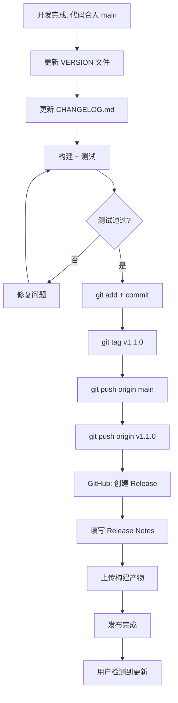

# Zensers 版本管理与升级通知系统设计方案

> 版本: v1.4  
> 状态: 已审查修订，待审批  
> 日期: 2026-05-13
> 
> 修订记录:
> - v1.0: 初版
> - v1.1: 修复 12 项审查问题（见附录 9.5）
> - v1.2: 二次审查修复 10 项问题（见附录 9.5）
> - v1.3: 三次审查修复 6 项问题（见附录 9.5）
> - v1.4: 五次审查修复 5 项问题（见附录 9.5）

---

## 目录

1. [背景与目标](#1-背景与目标)
2. [总体架构](#2-总体架构)
3. [版本管理方案](#3-版本管理方案)
4. [升级通知方案](#4-升级通知方案)
5. [前端升级检测实现](#5-前端升级检测实现)
6. [桌面端升级处理](#6-桌面端升级处理)
7. [发布工作流](#7-发布工作流)
8. [实施计划](#8-实施计划)
9. [附录](#9-附录)

---

## 1. 背景与目标

### 1.1 现状

- Zensers 项目已进入收尾阶段，即将发布
- 当前无版本管理机制，`main.py` 中硬编码 `version="1.0.0"`
- CHANGELOG 使用日期标签（如 `[2026-05-11]`），无语义化版本号
- 无版本检测、无升级通知机制
- 无 CI/CD、无 Release 流程

### 1.2 目标

1. **建立统一版本管理体系**：VERSION 文件作为唯一版本源，前后端一致
2. **设计升级通知机制**：让用户知道新版本发布
3. **前端检测版本**：应用启动时自动检测并提示
4. **桌面端升级支持**：pywebview 模式下可下载替换
5. **规范发布流程**：从开发到发布可追溯、可重复

### 1.3 约束条件

- 开源项目，团队人力有限
- 无自建服务器基础设施
- 应用形态：Web + Desktop(pywebview) + CLI 三合一
- 用户数据存储在本地 SQLite，无需考虑数据迁移（数据库 schema 变更需注意）
- **国内用户可能存在 GitHub 访问不稳定情况** —— 需要回退方案

---

## 2. 总体架构

### 2.1 架构总览

```
┌──────────────────────────────────────────────────────────────────────────┐
│                            发布与分发层                                    │
│                                                                          │
│  ┌──────────────────────────────────────────────────────────────────┐    │
│  │                     GitHub Releases                              │    │
│  │  ├─ 版本号 (tag)                                                  │    │
│  │  ├─ Release Notes (CHANGELOG 内容)                                │    │
│  │  ├─ 构建产物附件 (打包的桌面端安装包/更新包)                          │    │
│  │  └─ Gitee/GitLab 镜像 (国内用户回退)                               │    │
│  └──────────────────────────────────────────────────────────────────┘    │
└──────────────────────────────────────────────────────────────────────────┘
                                    │
                                    ▼
┌──────────────────────────────────────────────────────────────────────────┐
│                           版本服务层 (后端)                                │
│                                                                          │
│  ┌──────────────────────┐    ┌──────────────────────────────────────┐    │
│  │  VERSION 文件          │    │  远程版本源 (按优先级)               │    │
│  │  项目根目录唯一版本源   │    │  ├─ 1. GitHub API (主要)           │    │
│  │  读取为 local_version  │    │  ├─ 2. Gitee API (国内镜像)        │    │
│  └────────┬─────────────┘    │  └─ 3. 缓存 (10min TTL)             │    │
│           │                  └──────────────┬───────────────────────┘    │
│           │                                 │                            │
│           └──────────┬──────────────────────┘                            │
│                      ▼                                                   │
│           ┌──────────────────────────────────────┐                      │
│           │  后端 /api/v1/version                  │                      │
│           │  ├─ local_version  (来自 VERSION 文件)  │                      │
│           │  ├─ remote_version (来自远程 API/缓存)  │                      │
│           │  ├─ is_latest      (权威判断)           │                      │
│           │  ├─ check_error    (null/错误信息)      │                      │
│           │  └─ build_date     (构建日期)           │                      │
│           └──────────────────┬───────────────────┘                      │
└──────────────────────────────┬────────────────────────────────────────────┘
                               │
                               ▼
┌──────────────────────────────────────────────────────────────────────────┐
│                          客户端检测层 (前端)                               │
│                                                                          │
│  ┌──────────────────────────────┐                                        │
│  │  useVersionCheck Hook         │                                        │
│  │  ├─ 启动时调用 /api/v1/version │                                        │
│  │  ├─ 信任 is_latest 权威判断    │                                        │
│  │  ├─ 每30分钟轮询              │                                        │
│  │  └─ 手动检测                  │                                        │
│  └──────────┬───────────────────┘                                        │
│             │                                                             │
│             ▼                                                             │
│  ┌──────────────────────────────────────────────────────┐                │
│  │   版本对比引擎 (仅用于展示和信息目的，不做通知决策)      │                │
│  │   local_version  vs  remote_version                   │                │
│  │   (不比较 currentVersion, 避免闭环)                    │                │
│  └──────────────────────────────────────────────────────┘                │
│                                                                          │
│  ┌─────────────────────────────────────┐                                 │
│  │  localStorage 持久化                 │                                 │
│  │  ├─ last_seen_build_date (热部署)    │                                 │
│  │  ├─ dismissed_updates (上限10条)    │                                 │
│  │  └─ 90天自动清理                     │                                 │
│  └─────────────────────────────────────┘                                 │
└──────────────────────────────────────────────────────────────────────────┘
                               │
                               ▼
┌──────────────────────────────────────────────────────────────────────────┐
│                            通知展现层                                     │
│                                                                          │
│  ┌──────────────┐  ┌────────────┐  ┌──────────────┐  ┌───────────────┐  │
│  │ UpdateBanner  │  │Header 徽章 │  │ Settings 面板  │  │ Desktop      │  │
│  │ 启动横幅       │  │右上角小红点  │  │ 完整版本信息    │  │ 系统原生通知  │  │
│  │ is_latest=false│  │ 含网络状态   │  │ 含检测错误显示  │  │ plyer 实现   │  │
│  └──────────────┘  └────────────┘  └──────────────┘  └───────────────┘  │
│                                                                          │
│  通知优先级: 启动横幅 > Desktop 通知 > Header 徽章 > Settings 面板        │
└──────────────────────────────────────────────────────────────────────────┘
```

### 2.2 关键数据流（修复 v1.1）

修复了 v1.0 中版本检测逻辑闭环的问题：

```
用户运行 v1.0.0，GitHub 上已发布 v1.1.0：

┌─────────────────────────────────────────────────────────────────────┐
│ 前端 (构建版本: v1.0.0)                                             │
│                                                                     │
│  GET /api/v1/version                                                │
│    ↓                                                                │
│ 后端 version.py:                                                    │
│    ├─ 读取 VERSION 文件        →  local_version = "1.0.0"          │
│    ├─ 调用 GitHub API          →  remote_version = "1.1.0"         │
│    ├─ 对比 local < remote      →  is_latest = false                │
│    └─ 返回给前端:                                                   │
│       {                                                             │
│         "local_version": "1.0.0",    ← 用户当前版本                  │
│         "remote_version": "1.1.0",   ← 远程最新版本                  │
│         "is_latest": false,           ← 权威判断标志                 │
│         "check_error": null,          ← 检测状态                    │
│         "build_date": "2026-05-13"                                   │
│       }                                                             │
│    ↑                                                                │
│ 前端 useVersionCheck:                                               │
│    ├─ 检查 is_latest === false → 显示更新横幅                        │
│    ├─ 标题: "Zensers v1.1.0 is available (you are on v1.0.0)"      │
│    ├─ 不拿 currentVersion 与任何值比较 (避免闭环)                    │
│    └─ localStorage.dismissed_updates 检查版本号                      │
└─────────────────────────────────────────────────────────────────────┘

关键变化 (对比 v1.0):
  v1.0: 前端比较 currentVersion vs backend.version      ← 永远相等, 有 bug
  v1.1: 前端直接信任 backend.is_latest, 展示用两字段     ← 正确
        后端明确返回 local_version + remote_version 两值
```

---

## 3. 版本管理方案

### 3.1 版本号规范

采用 **语义化版本 2.0.0** (SemVer)：

```
MAJOR.MINOR.PATCH[-PRERELEASE][+BUILD]
```

| 位 | 含义 | 何时递增 |
|----|------|---------|
| MAJOR | 不兼容的 API 修改 | 重大架构变更、破坏性更新 |
| MINOR | 向下兼容的功能新增 | 新功能、新模块 |
| PATCH | 向下兼容的问题修复 | Bug 修复、性能优化 |
| PRERELEASE | 预发布标识 | alpha, beta, rc |

**Pre-release 优先级规则 (SemVer §11)**：
- 有 pre-release 标识的版本 < 正式版本：`1.0.0-alpha < 1.0.0`
- 数字标识符按数值比较：`1.0.0-beta.2 < 1.0.0-beta.11`
- 字符串标识符按字典序比较：`1.0.0-alpha < 1.0.0-beta`
- 数字标识符优先级低于字符串标识符：`1.0.0-1 < 1.0.0-alpha`

### 3.2 版本文件体系

#### 3.2.1 VERSION 文件（唯一版本源）

**路径**: `E:\market_report_systerm\VERSION`

```
1.0.0
```

约定规则：
- 纯文本文件，仅包含版本号
- **允许尾部换行符**（符合 POSIX 标准），读取时 `.strip()` 处理
- 所有版本信息以此为唯一真实来源
- 路径可通过环境变量 `ZENSERS_VERSION_FILE` 覆盖
- Python 包 `src/__init__.py` 中同时定义 `__version__` 作为备选

#### 3.2.2 __version__ 备选

```python
# src/__init__.py
__version__ = "1.0.0"
```

当 `VERSION` 文件不存在且环境变量未设置时，回退到 `import __version__`。

#### 3.2.3 版本信息对象

后端 `/api/v1/version` 返回的标准格式：

```json
{
  "local_version": "1.0.0",
  "remote_version": "1.1.0",
  "build_date": "2026-05-13",
  "is_latest": false,
  "check_error": null,
  "changelog_url": "/api/v1/changelog",
  "release_url": "https://github.com/YOUR_ORG/zensers/releases/tag/v1.1.0",
  "release_notes": "简要更新说明",
  "desktop_download_url": "https://github.com/YOUR_ORG/zensers/releases/download/v1.1.0/zensers-desktop-v1.1.0.zip",
  "published_at": "2026-05-13"
}
```

| 字段 | 类型 | 说明 |
|------|------|------|
| `local_version` | string | 本地 VERSION 文件读取的版本号 |
| `remote_version` | string | 远程获取的最新版本号（GitHub/Gitee/缓存） |
| `build_date` | string | 构建日期 |
| `is_latest` | boolean\|null | **权威判断**：`false`=有更新, `true`=已最新, `null`=检测失败 |
| `check_error` | string\|null | 检测失败时的错误消息（如"GitHub 不可达"） |
| `changelog_url` | string | 更新日志链接 |
| `release_url` | string | Release 页面链接 |
| `release_notes` | string | 更新说明摘要 |
| `desktop_download_url` | string | 桌面端下载链接 |
| `published_at` | string | 发布日期 |

### 3.3 后端版本管理模块

**新增文件**: `src/core/version.py`

职责：
1. 读取 `VERSION` 文件获取本地版本号（路径可配置）
2. 按优先级尝试获取远程版本：GitHub API → Gitee API → 缓存
3. 实现完整的 SemVer 对比（含 prerelease）
4. 缓存远程版本结果（10 分钟 TTL），使用 ETag 条件请求节省配额
5. 返回统一的版本信息对象

```python
"""
src/core/version.py - 版本管理模块
"""

import re
import os
import json
import time
from pathlib import Path
from datetime import date
from typing import Optional
from dataclasses import dataclass, asdict, field

import httpx

# ================================================================
# 配置
# ================================================================

# VERSION 文件路径（可通过环境变量覆盖）
_DEFAULT_VERSION_FILE = Path(__file__).resolve().parent.parent.parent / "VERSION"
VERSION_FILE = Path(os.getenv("ZENSERS_VERSION_FILE", str(_DEFAULT_VERSION_FILE)))

# GitHub 仓库信息
GITHUB_OWNER = os.getenv("GITHUB_OWNER", "YOUR_ORG")
GITHUB_REPO = os.getenv("GITHUB_REPO", "zensers")
GITHUB_API_URL = f"https://api.github.com/repos/{GITHUB_OWNER}/{GITHUB_REPO}/releases/latest"

# Gitee 镜像（国内用户回退）
GITEE_OWNER = os.getenv("GITEE_OWNER", "")
GITEE_REPO = os.getenv("GITEE_REPO", "")
GITEE_API_URL = f"https://gitee.com/api/v5/repos/{GITEE_OWNER}/{GITEE_REPO}/releases/latest"

# 远程版本缓存（10分钟 TTL）
_REMOTE_CACHE: dict = {
    "data": None,       # 缓存的远程版本信息
    "etag": None,       # GitHub ETag
    "timestamp": 0,     # 缓存时间戳
}
CACHE_TTL = 600  # 10 分钟

REQUEST_TIMEOUT = 5


# ================================================================
# 数据模型
# ================================================================

@dataclass
class VersionInfo:
    """版本信息"""
    local_version: str                    # 本地版本号
    remote_version: str = ""              # 远程最新版本号
    build_date: str = ""                  # 构建日期
    is_latest: Optional[bool] = True      # 是否最新 (null=检测失败)
    check_error: Optional[str] = None     # 检测失败原因
    changelog_url: str = "/api/v1/changelog"
    release_url: str = ""
    release_notes: str = ""
    desktop_download_url: str = ""
    published_at: str = ""

    def to_dict(self) -> dict:
        return {
            "local_version": self.local_version,
            "remote_version": self.remote_version,
            "build_date": self.build_date,
            "is_latest": self.is_latest,
            "check_error": self.check_error,
            "changelog_url": self.changelog_url,
            "release_url": self.release_url,
            "release_notes": self.release_notes,
            "desktop_download_url": self.desktop_download_url,
            "published_at": self.published_at,
        }


# ================================================================
# 版本号读取
# ================================================================

def get_local_version() -> str:
    """
    从 VERSION 文件读取本地版本号
    优先级: 环境变量 > VERSION 文件 > __version__ > "0.0.0"
    """
    # 1. 环境变量
    env_ver = os.getenv("ZENSERS_VERSION")
    if env_ver:
        return env_ver

    # 2. VERSION 文件
    try:
        version = VERSION_FILE.read_text(encoding="utf-8").strip()
        if re.match(r"^\d+\.\d+\.\d+", version):
            return version
    except (FileNotFoundError, OSError):
        pass

    # 3. __version__ 备选
    try:
        from src import __version__
        if __version__:
            return __version__
    except (ImportError, AttributeError):
        pass

    # 4. 最终回退
    return "0.0.0"


def get_build_date() -> str:
    """获取构建日期，优先环境变量"""
    return os.getenv("BUILD_DATE", date.today().isoformat())


# ================================================================
# SemVer 对比 (含 Pre-release)
# ================================================================

def _parse_prerelease(segment: str) -> list:
    """
    解析 prerelease 标识符为可比较格式
    例如: "beta.2" → ["beta", 2], "rc.1" → ["rc", 1]
    每个标识符: 纯数字→int, 否则→str (按 SemVer §11 规则)
    """
    if not segment:
        return [float("inf")]  # 无 prerelease >
    parts = []
    for p in segment.split("."):
        try:
            parts.append(int(p))
        except ValueError:
            parts.append(p)
    return parts


def _cmp_prerelease(p1: list, p2: list) -> int:
    """
    比较两个 prerelease 标识符列表
    返回 1: p1 > p2, 0: p1 == p2, -1: p1 < p2
    按 SemVer §11:
    - 数字 < 字符串 (如 1 < alpha)
    - 数字按数值比 (2 < 11)
    - 字符串按字典序 (alpha < beta)
    - 较短且全匹配的更大 (1.0.0-alpha < 1.0.0-alpha.1)
    """
    # 类型守卫: 确保所有元素为 int 或 str
    # 使用显式 if 而非 assert，避免 python -O 优化模式下被移除
    for x in p1 + p2:
        if not isinstance(x, (int, str)):
            raise TypeError(
                f"prerelease identifiers must be int or str, got {type(x).__name__}: {x}"
            )

    max_len = max(len(p1), len(p2))
    for i in range(max_len):
        if i >= len(p1):
            return -1  # p1 shorter → p1 < p2
        if i >= len(p2):
            return 1   # p2 shorter → p1 > p2
        a, b = p1[i], p2[i]
        # 类型不同: 数字 < 字符串
        if type(a) != type(b):
            return -1 if isinstance(a, int) else 1
        # 相同类型比较
        if a < b:
            return -1
        if a > b:
            return 1
    return 0


def compare_versions(v1: str, v2: str) -> int:
    """
    完整的 SemVer 版本号对比
    返回 1: v1 > v2, 0: v1 == v2, -1: v1 < v2

    示例:
      compare_versions("1.0.0", "1.0.0")        →  0
      compare_versions("1.0.0", "1.1.0")         → -1
      compare_versions("2.0.0", "1.9.9")         →  1
      compare_versions("1.0.0-alpha", "1.0.0")   → -1  (prerelease < release)
      compare_versions("1.0.0-beta.2", "1.0.0-beta.11") → -1  (数字按数值)
      compare_versions("1.0.0-1", "1.0.0-alpha") → -1  (数字 < 字符串)
    """
    # 分离主版本和 prerelease
    parts1 = v1.split("-", 1)
    parts2 = v2.split("-", 1)

    main1 = parts1[0]
    main2 = parts2[0]
    pre1 = parts1[1] if len(parts1) > 1 else ""
    pre2 = parts2[1] if len(parts2) > 1 else ""

    # 比较主版本 (MAJOR.MINOR.PATCH)
    def parse_main(v: str) -> tuple:
        nums = []
        for p in v.split("."):
            try:
                nums.append(int(p))
            except ValueError:
                nums.append(0)
        while len(nums) < 3:
            nums.append(0)
        return tuple(nums[:3])

    t1, t2 = parse_main(main1), parse_main(main2)

    if t1 > t2:
        return 1
    if t1 < t2:
        return -1

    # 主版本相等 → 比较 prerelease
    # 无 prerelease > 有 prerelease
    if not pre1 and not pre2:
        return 0
    if not pre1:
        return 1  # 1.0.0 > 1.0.0-alpha
    if not pre2:
        return -1  # 1.0.0-alpha < 1.0.0

    return _cmp_prerelease(
        _parse_prerelease(pre1),
        _parse_prerelease(pre2),
    )


# ================================================================
# 远程版本获取 (含缓存 + 多源回退)
# ================================================================

async def _fetch_github() -> tuple:
    """
    从 GitHub API 获取最新 Release
    使用 ETag 条件请求节省配额

    返回: (data_dict|None, error_str|None)
      - (data, None)         成功获取
      - (data, "rate_limited")  429 限频，返回过期缓存
      - (None, "rate_limited")  429 限频且无缓存
      - (None, "network_error") 其他网络错误
    """
    headers = {"Accept": "application/vnd.github.v3+json"}
    if _REMOTE_CACHE["etag"]:
        headers["If-None-Match"] = _REMOTE_CACHE["etag"]

    try:
        async with httpx.AsyncClient(timeout=REQUEST_TIMEOUT) as client:
            resp = await client.get(GITHUB_API_URL, headers=headers)

            if resp.status_code == 304:
                # Not Modified - 刷新缓存有效期，返回缓存数据
                _REMOTE_CACHE["timestamp"] = time.time()
                return _REMOTE_CACHE["data"], None

            resp.raise_for_status()
            data = resp.json()
            etag = resp.headers.get("etag", "")

            result = {
                "version": data.get("tag_name", "").lstrip("v"),
                "release_notes": (data.get("body") or "")[:500],
                "release_url": data.get("html_url", ""),
                "published_at": (data.get("published_at") or "")[:10] if data.get("published_at") else "",
                "source": "github",
            }

            # 更新缓存
            _REMOTE_CACHE["data"] = result
            _REMOTE_CACHE["etag"] = etag
            _REMOTE_CACHE["timestamp"] = time.time()

            return result, None

    except httpx.HTTPStatusError as e:
        if e.response.status_code == 429:
            # Rate limited - 使用过期缓存并标记错误
            if _REMOTE_CACHE["data"]:
                return _REMOTE_CACHE["data"], "rate_limited"
            return None, "rate_limited"
        return None, "network_error"
    except Exception:
        return None, "network_error"


async def _fetch_gitee() -> tuple:
    """
    从 Gitee API 获取最新 Release (国内用户回退)

    返回: (data_dict|None, error_str|None)
      data 中 source 字段标记为 "gitee"
    """
    if not GITEE_OWNER or not GITEE_REPO:
        return None, "not_configured"

    try:
        async with httpx.AsyncClient(timeout=REQUEST_TIMEOUT) as client:
            resp = await client.get(GITEE_API_URL)
            resp.raise_for_status()
            data = resp.json()
            result = {
                "version": data.get("tag_name", "").lstrip("v"),
                "release_notes": (data.get("body") or "")[:500],
                "release_url": data.get("html_url", ""),
                "published_at": (data.get("created_at") or "")[:10] if data.get("created_at") else "",
                "source": "gitee",
            }
            return result, None
    except Exception:
        return None, "network_error"


def _get_cached_remote() -> Optional[dict]:
    """获取缓存的远程版本（未过期）"""
    if (_REMOTE_CACHE["data"]
            and time.time() - _REMOTE_CACHE["timestamp"] < CACHE_TTL):
        return _REMOTE_CACHE["data"]
    return None


async def fetch_remote_version() -> tuple:
    """
    获取远程最新版本
    优先级: 缓存(在 TTL 内) > GitHub API > Gitee(国内镜像) > None

    返回: (data_dict|None, error_str|None)
      error_str 取值:
        None                 正常
        "rate_limited"       429 限频，数据基于缓存
        "remote_unreachable" 所有源不可达
        "network_error"      网络请求失败
    """
    # 1. 缓存命中（且在 TTL 内）
    cached = _get_cached_remote()
    if cached:
        return cached, None

    # 2. GitHub API
    github_data, github_err = await _fetch_github()
    if github_data:
        # 429 限频回退缓存时也保留错误标记
        return github_data, github_err  # 可能为 "rate_limited"

    # 3. Gitee 回退
    gitee_data, gitee_err = await _fetch_gitee()
    if gitee_data:
        return gitee_data, None

    # 4. 全部失败：使用过期缓存（有比没有好）
    if _REMOTE_CACHE["data"]:
        return _REMOTE_CACHE["data"], "remote_unreachable"

    return None, "remote_unreachable"


# ================================================================
# 主入口
# ================================================================

async def get_version_info() -> VersionInfo:
    """
    获取完整版本信息（主入口）

    返回数据结构包含:
      - local_version: 本地版本
      - remote_version: 远程版本（成功时）
      - is_latest: false=有更新, true=已最新, null=检测失败
      - check_error: 检测失败时的错误消息
    """
    local_ver = get_local_version()
    build_date = get_build_date()

    info = VersionInfo(
        local_version=local_ver,
        build_date=build_date,
    )

    remote, error = await fetch_remote_version()
    if remote:
        remote_ver = remote["version"]
        info.remote_version = remote_ver
        info.release_notes = remote.get("release_notes", "")
        info.release_url = remote.get("release_url", "")
        info.published_at = remote.get("published_at", "")

        # 根据版本来源选择下载域名（Gitee 回退时不用 GitHub 链接）
        source = remote.get("source", "github")
        if source == "gitee":
            info.desktop_download_url = (
                f"https://gitee.com/{GITEE_OWNER}/{GITEE_REPO}/"
                f"releases/download/v{remote_ver}/zensers-desktop-v{remote_ver}.zip"
            )
        else:
            info.desktop_download_url = (
                f"https://github.com/{GITHUB_OWNER}/{GITHUB_REPO}/"
                f"releases/download/v{remote_ver}/zensers-desktop-v{remote_ver}.zip"
            )

        cmp = compare_versions(local_ver, remote_ver)
        info.is_latest = (cmp >= 0)

        # 即使获取到数据，也要传递限频等持久性错误
        if error:
            info.check_error = error
            info.is_latest = None  # 基于过期缓存的数据不可靠，不展示更新提示
    else:
        # 远程检测失败
        info.is_latest = None
        info.check_error = error

    return info
```

#### Changelog API 实现

`/api/v1/changelog` 路由从 `CHANGELOG.md` 文件读取内容并返回：

```python
# src/api/main.py 新增路由

from pathlib import Path

CHANGELOG_PATH = Path(__file__).resolve().parent.parent.parent / "CHANGELOG.md"


@app.get("/api/v1/changelog")
async def get_changelog(
    format: str = "text",
    max_lines: int = 50,
):
    """
    返回 CHANGELOG 内容
    - format=text (默认): 返回纯文本，最近 max_lines 行
    - format=json: 返回按版本分割的 JSON 数组
    """
    if not CHANGELOG_PATH.exists():
        return {"changelog": "", "error": "CHANGELOG.md not found"}

    content = CHANGELOG_PATH.read_text(encoding="utf-8")

    if format == "json":
        # 按 "## [" 分割为版本块
        import re
        versions = re.split(r"\n(?=## \[)", content)
        entries = []
        for block in versions:
            if not block.strip():
                continue
            lines = block.strip().split("\n")
            header = lines[0] if lines else ""
            entries.append({
                "header": header,
                "body": "\n".join(lines[1:]).strip(),
            })
        return {"changelog": entries, "count": len(entries)}
    else:
        # 纯文本：截取最近 max_lines 行
        lines = content.strip().split("\n")
        truncated = lines[:max_lines]
        return {"changelog": "\n".join(truncated)}
```

### 3.4 前端版本注入

前端构建时嵌入 `NEXT_PUBLIC_APP_VERSION` 常量。**注意**：此常量仅用于展示和 fallback，不作为版本对比的输入。

```javascript
// web/next.config.js
const fs = require('fs');
const path = require('path');

const versionFile = path.join(__dirname, '..', 'VERSION');
const version = fs.existsSync(versionFile)
  ? fs.readFileSync(versionFile, 'utf-8').trim()
  : '0.0.0';

const nextConfig = {
  // ... 现有配置 ...
  env: {
    NEXT_PUBLIC_APP_VERSION: version,
    NEXT_PUBLIC_BUILD_DATE: new Date().toISOString().split('T')[0],
  },
};

module.exports = nextConfig;
```

### 3.5 前端版本工具（含完整 SemVer 支持）

```typescript
// web/src/lib/version.ts

/**
 * 解析 prerelease 标识符
 * 'beta.2' → ['beta', 2], 'rc.1' → ['rc', 1]
 */
function parsePrerelease(segment: string): (number | string)[] {
  if (!segment) return [Infinity];
  return segment.split('.').map(p => {
    const n = parseInt(p, 10);
    return isNaN(n) ? p : n;
  });
}

/**
 * 比较 prerelease 标识符列表
 * 数字 < 字符串，数字按数值，字符串按字典序
 */
function cmpPrerelease(a: (number | string)[], b: (number | string)[]): number {
  const maxLen = Math.max(a.length, b.length);
  for (let i = 0; i < maxLen; i++) {
    if (i >= a.length) return -1;
    if (i >= b.length) return 1;
    const va = a[i], vb = b[i];
    if (typeof va !== typeof vb) {
      return typeof va === 'number' ? -1 : 1;
    }
    if (va < vb) return -1;
    if (va > vb) return 1;
  }
  return 0;
}

/**
 * 完整 SemVer 对比（含 prerelease）
 * 返回 1: v1 > v2, 0: v1 === v2, -1: v1 < v2
 *
 * 示例:
 *   compareVersions("1.0.0-alpha", "1.0.0") → -1
 *   compareVersions("1.0.0-beta.2", "1.0.0-beta.11") → -1
 *   compareVersions("2.0.0", "1.9.9") → 1
 */
export function compareVersions(v1: string, v2: string): number {
  const [main1 = '', pre1 = ''] = v1.split('-', 2);
  const [main2 = '', pre2 = ''] = v2.split('-', 2);

  // 比较主版本
  const parseMain = (v: string): number[] => {
    const nums = v.split('.').map(p => parseInt(p) || 0);
    while (nums.length < 3) nums.push(0);
    return nums.slice(0, 3);
  };

  const t1 = parseMain(main1);
  const t2 = parseMain(main2);

  for (let i = 0; i < 3; i++) {
    if (t1[i] > t2[i]) return 1;
    if (t1[i] < t2[i]) return -1;
  }

  // prerelease 比较
  if (!pre1 && !pre2) return 0;
  if (!pre1) return 1;   // 1.0.0 > 1.0.0-alpha
  if (!pre2) return -1;  // 1.0.0-alpha < 1.0.0

  return cmpPrerelease(parsePrerelease(pre1), parsePrerelease(pre2));
}
```

---

## 4. 升级通知方案

### 4.1 通知策略总览

| 通知渠道 | 触发时机 | 展现形式 | 优先级 | 可关闭 |
|---------|---------|---------|-------|--------|
| 启动横幅 | `is_latest === false` | 页面顶部全宽横幅 | P0 | 可关闭，记版本号，7天不重复弹 |
| Desktop 系统通知 | `is_latest === false` + 窗口最小化 | Windows 原生通知 (plyer) | P1 | 自动消失 |
| Header 徽章 | 有更新（`is_latest !== true`） | 导航栏小红点 | P2 | 版本升级后消失 |
| Settings 面板 | 用户主动打开设置 | 版本信息卡片（含检测状态） | P3 | 不适用 |

### 4.2 启动横幅（核心通知）

#### 4.2.1 展现设计

```
┌──────────────────────────────────────────────────────────────────┐
│ ▓▓▓▓▓▓▓▓▓▓▓▓▓▓▓▓▓▓▓▓▓▓▓▓▓▓▓▓▓▓▓▓▓▓▓▓▓▓▓▓▓▓▓▓▓▓▓▓▓▓▓▓▓▓▓▓▓▓▓ │
│                                                                  │
│   🚀  Zensers v1.1.0 已发布！                                    │
│                                                                  │
│   新增功能：                                                     │
│   · 智能路由优化 - 自动选择最佳研究路径                           │
│   · 多语言报告支持 - 支持中文/英文报告输出                        │
│   · 导出性能提升 - Word/PDF 导出速度提升 50%                     │
│                                                                  │
│   ┌──────────────┐    ┌──────────────────┐                      │
│   │ 📄 更新日志    │    │ 🔄 立即刷新       │                      │
│   └──────────────┘    └──────────────────┘                      │
│                                                                  │
│   下次提醒我: [一周后 ▾]                              [✕ 关闭]   │
│                                                                  │
│ ▓▓▓▓▓▓▓▓▓▓▓▓▓▓▓▓▓▓▓▓▓▓▓▓▓▓▓▓▓▓▓▓▓▓▓▓▓▓▓▓▓▓▓▓▓▓▓▓▓▓▓▓▓▓▓▓▓▓▓ │
└──────────────────────────────────────────────────────────────────┘
```

#### 4.2.2 行为逻辑

```
应用启动
  │
  ├─▶ useVersionCheck hook 执行
  │     │
  │     ├─▶ GET /api/v1/version
  │     │
  │     ├─▶ 检查 is_latest
  │     │     │
  │     │     ├─▶ false → 有更新，进入通知决策
  │     │     ├─▶ true  → 已最新，无操作
  │     │     └─▶ null  → 检测失败，Settings面板显示错误
  │     │                 不弹横幅（不确定是否有更新）
  │     │
  │     └─▶ 通知决策 (仅 is_latest === false 时)
  │           │
  │           ├─▶ 检查 localStorage.dismissed_updates
  │           │     │
  │           │     ├─▶ 包含 remote_version → 跳过横幅，显示徽章
  │           │     │     (超过7天则重置)
  │           │     │
  │           │     └─▶ 未包含 → 显示横幅
  │           │
  │           └─▶ Desktop 模式 + 窗口最小化 → 系统通知
  │
  └─▶ 每30分钟轮询一次
        │
        └─▶ 更新 is_latest 状态
             不重复弹横幅
```

#### 4.2.3 关闭/忽略规则

localStorage 存储结构（上限 10 条，90 天自动清理）：

```typescript
interface DismissedUpdate {
  version: string;      // 远程版本号
  dismissedAt: string;  // ISO 时间戳
  remindAfter: number;  // 下次提醒间隔（天），默认7
}

const STORAGE_KEY = 'zensers_dismissed_updates';
const MAX_DISMISSED = 10;
const CLEANUP_DAYS = 90;
```

规则：
1. 用户关闭 → 记入 dismissed_updates，当前版本 7 天内不弹
2. 新版本发布（`remote_version` 不同）→ 立即弹窗
3. 7 天后该版本记录过期 → 再次弹窗
4. 写入时自动清理：保留最近 10 条，移除 90 天前的记录

### 4.3 Header 徽章（持续提醒）

```
┌─────────────────────────────────────────────────────────────┐
│  Zensers                            [🔔 New]  [⚙️]  [📋]   │
└─────────────────────────────────────────────────────────────┘
```

- `is_latest === false` 时显示
- `is_latest === null` 时不显示（无法确定是否有更新）
- 点击跳转 Settings 页面版本面板

### 4.4 Settings 面板（完整信息 + 检测状态）

在 GeneralPanel 底部新增版本卡片。与 v1.0 的关键区别：**网络检测状态始终显示**。

```
┌──────────────────────────────────────────────────────┐
│  📦  Version Information                             │
│                                                      │
│  ┌──────────────────────────────────────────────────┐│
│  │  Local Version     1.0.0                        ││
│  │  Build Date        2026-05-13                   ││
│  │  Remote Version    1.1.0                        ││
│  │  Last Checked      2026-05-13 10:30             ││
│  └──────────────────────────────────────────────────┘│
│                                                      │
│  [🔍 Check for Updates]  [📄 View Changelog]       │
│                                                      │
│  ┌──────────────────────────────────────────────────┐│
│  │  ✅  You are running the latest version          ││  ← is_latest=true
│  │  🚀  v1.1.0 is available!                       ││  ← is_latest=false
│  │  ⚠️  Unable to check for updates                 ││  ← is_latest=null
│  │      Last error: GitHub unreachable.             ││     显示错误原因
│  │      Please check your network connection.        ││
│  └──────────────────────────────────────────────────┘│
│                                                      │
│  (is_latest=false 时额外显示):                       │
│  What's new in v1.1.0:                              │
│  • Intelligent routing optimization                 │
│  • Multi-language report support                    │
│                                                      │
│  ┌──────────────┐  ┌──────────────────┐            │
│  │ 📄 更新日志    │  │ 🔄 立即刷新       │            │
│  └──────────────┘  └──────────────────┘            │
└──────────────────────────────────────────────────────┘
```

### 4.5 版本检测频率策略

| 场景 | 触发方式 | 频率 | 备注 |
|------|---------|------|------|
| 应用启动 | 自动 | 每次启动 | 核心检测时机 |
| 应用运行中 | 定时轮询 | 每30分钟 | 后端有10min缓存，不会触发 GitHub |
| 用户主动检查 | Settings 按钮 | 用户触发 | 绕过缓存，实时检测 |
| Desktop 恢复前台 | `visibilitychange` | 每次激活 | 覆盖长时间最小化场景 |

### 4.6 网络不可用的降级策略（修复 v1.1）

```
┌─────────────────────────────────────────────────┐
│  fetch_remote_version()                          │
│                                                  │
│  ├─ 1. 检查缓存 (TTL 内) → 命中则返回            │
│  │                                                 │
│  ├─ 2. GitHub API                                │
│  │   ├─ 成功 → 更新缓存，返回                    │
│  │   ├─ 429 (限频) → 用过期缓存                  │
│  │   └─ 网络错误 → 进入下一步                    │
│  │                                                 │
│  ├─ 3. Gitee API (国内镜像)                      │
│  │   ├─ 成功 → 更新缓存，返回                    │
│  │   └─ 失败 → 进入下一步                        │
│  │                                                 │
│  └─ 4. 全部失败                                  │
│        ├─ 过期缓存存在 → 返回 + 标记错误          │
│        └─ 无缓存 → is_latest=null + error 信息    │
└─────────────────────────────────────────────────┘
                                   │
                                   ▼
                          ┌──────────────────────┐
                          │  前端行为             │
                          │                      │
                          │  is_latest = null    │
                          │  check_error 非空     │
                          │                      │
                          │  ├─ 不弹横幅          │
                          │  ├─ Header 无徽章     │
                          │  └─ Settings 显示:    │
                          │     ⚠️ Unable to     │
                          │     check for updates │
                          │     + 错误详情         │
                          │     + Retry 按钮      │
                          └──────────────────────┘
```

---

## 5. 前端升级检测实现

### 5.1 新增文件

| 文件 | 类型 | 职责 |
|------|------|------|
| `web/src/lib/version.ts` | 工具库 | 完整 SemVer 版本对比（含 prerelease） |
| `web/src/hooks/useVersionCheck.ts` | Hook | 版本检测逻辑，信任后端 `is_latest` |
| `web/src/types/version.ts` | 类型定义 | 版本相关 TS 类型 |
| `web/src/components/layout/UpdateBanner.tsx` | 组件 | 启动横幅 |
| `web/src/components/layout/UpdateBadge.tsx` | 组件 | Header 徽章 |

### 5.2 类型定义

```typescript
// web/src/types/version.ts

export interface VersionInfo {
  local_version: string;
  remote_version: string;
  build_date: string;
  is_latest: boolean | null;   // null = check failed
  check_error: string | null;  // null = no error, or error message
  changelog_url: string;
  release_url: string;
  release_notes: string;
  desktop_download_url: string;
  published_at: string;
}

export interface DismissedUpdate {
  version: string;
  dismissedAt: string;
  remindAfter: number;
}
```

### 5.3 Version Check Hook（修复 v1.1）

**核心变化**: 不再比较 `currentVersion` 与后端返回值，而是**直接信任后端的 `is_latest` 字段**。

```typescript
// web/src/hooks/useVersionCheck.ts

'use client';

import { useState, useEffect, useCallback, useRef } from 'react';
import api from '@/lib/api';
import type { VersionInfo, DismissedUpdate } from '@/types/version';

const POLL_INTERVAL = 30 * 60 * 1000;  // 30分钟
const DISMISSED_KEY = 'zensers_dismissed_updates';
const MAX_DISMISSED = 10;
const CLEANUP_DAYS = 90;

export function useVersionCheck() {
  const [versionInfo, setVersionInfo] = useState<VersionInfo | null>(null);
  const [hasUpdate, setHasUpdate] = useState(false);
  const [bannerVisible, setBannerVisible] = useState(false);
  const [checkError, setCheckError] = useState<string | null>(null);
  const [loading, setLoading] = useState(false);

  // 仅用于展示，不参与比较
  const currentVersion = process.env.NEXT_PUBLIC_APP_VERSION || '0.0.0';

  /**
   * 清理过期记录
   */
  const cleanupDismissed = (entries: DismissedUpdate[]): DismissedUpdate[] => {
    const cutoff = Date.now() - CLEANUP_DAYS * 24 * 60 * 60 * 1000;
    return entries
      .filter(e => new Date(e.dismissedAt).getTime() > cutoff)
      .slice(-MAX_DISMISSED);
  };

  /**
   * 检查某版本是否被忽略
   */
  const isVersionDismissed = useCallback((version: string): boolean => {
    try {
      const stored = localStorage.getItem(DISMISSED_KEY);
      if (!stored) return false;
      const dismissed: DismissedUpdate[] = JSON.parse(stored);
      const entry = dismissed.find(d => d.version === version);
      if (!entry) return false;

      const elapsed = Date.now() - new Date(entry.dismissedAt).getTime();
      return elapsed < entry.remindAfter * 24 * 60 * 60 * 1000;
    } catch {
      return false;
    }
  }, []);

  /**
   * 忽略版本
   */
  const dismissVersion = useCallback((version: string, remindAfter = 7) => {
    try {
      const stored = localStorage.getItem(DISMISSED_KEY);
      let dismissed: DismissedUpdate[] = stored ? JSON.parse(stored) : [];
      dismissed = dismissed.filter(d => d.version !== version);
      dismissed.push({ version, dismissedAt: new Date().toISOString(), remindAfter });
      localStorage.setItem(DISMISSED_KEY, JSON.stringify(cleanupDismissed(dismissed)));
      setBannerVisible(false);
    } catch {
      // 静默失败
    }
  }, []);

  /**
   * 检测版本
   * @param showBanner 是否允许弹横幅（轮询时 false）
   */
  // 组件挂载守卫：防止卸载后异步 setState
  const mountedRef = useRef(true);
  useEffect(() => {
    return () => { mountedRef.current = false; };
  }, []);

  const checkVersion = useCallback(async (showBanner = true) => {
    if (!mountedRef.current) return;
    setLoading(true);
    try {
      const info = await api.getVersion();
      if (!mountedRef.current) return;
      setVersionInfo(info);

      // ○---------------------------------------------------------○
      // | 关键逻辑: 信任后端 is_latest 作为权威判断                   |
      // | is_latest = false → 有更新                                 |
      // | is_latest = true  → 已最新                                 |
      // | is_latest = null  → 检测失败，不判断                       |
      // ○---------------------------------------------------------○

      if (info.is_latest === false) {
        if (!mountedRef.current) return;
        setHasUpdate(true);
        setCheckError(null);

        if (showBanner && !isVersionDismissed(info.remote_version)) {
          if (!mountedRef.current) return;
          setBannerVisible(true);
        }
      } else if (info.is_latest === true) {
        if (!mountedRef.current) return;
        setHasUpdate(false);
        setCheckError(null);
      } else {
        // is_latest === null → 检测失败
        if (!mountedRef.current) return;
        setHasUpdate(false);
        setCheckError(info.check_error || 'Update check failed');
      }
    } catch (err) {
      if (!mountedRef.current) return;
      // API 调用本身失败（网络不通等）
      setCheckError('Unable to reach update server');
    } finally {
      if (mountedRef.current) {
        setLoading(false);
      }
    }
  }, [isVersionDismissed]);

  // 启动检测
  useEffect(() => {
    checkVersion();
  }, [checkVersion]);

  // 定时轮询
  useEffect(() => {
    const interval = setInterval(() => checkVersion(false), POLL_INTERVAL);
    return () => clearInterval(interval);
  }, [checkVersion]);

  // 窗口恢复前台时检测
  useEffect(() => {
    const handler = () => {
      if (document.visibilityState === 'visible') {
        checkVersion(false);
      }
    };
    document.addEventListener('visibilitychange', handler);
    window.addEventListener('focus', handler);
    return () => {
      document.removeEventListener('visibilitychange', handler);
      window.removeEventListener('focus', handler);
    };
  }, [checkVersion]);

  return {
    currentVersion,       // 仅展示
    versionInfo,          // 后端返回的完整版本信息
    hasUpdate,            // is_latest === false
    bannerVisible,        // 是否显示横幅
    checkError,           // 检测失败的错误消息
    loading,
    checkVersion,         // 手动触发
    dismissVersion,       // 关闭横幅
  };
}
```

### 5.4 API Client 扩展

```typescript
// web/src/lib/api.ts - 新增方法

export interface VersionInfo {
  local_version: string;
  remote_version: string;
  build_date: string;
  is_latest: boolean | null;
  check_error: string | null;
  changelog_url: string;
  release_url: string;
  release_notes: string;
  desktop_download_url: string;
  published_at: string;
}

// ApiClient 类中新增:
async getVersion(): Promise<VersionInfo> {
  const { data } = await this.client.get('/api/v1/version');
  return data;
}
```

### 5.5 UpdateBanner 组件

```typescript
// web/src/components/layout/UpdateBanner.tsx

'use client';

import { X, ExternalLink, RefreshCw } from 'lucide-react';
import { Button } from '@/components/ui/button';
import { useVersionCheck } from '@/hooks/useVersionCheck';
import { useDesktopStore } from '@/store/useDesktopStore';

export function UpdateBanner() {
  const { bannerVisible, versionInfo, dismissVersion } = useVersionCheck();
  const isDesktop = useDesktopStore((s) => s.isDesktop);

  if (!bannerVisible || !versionInfo) return null;

  const handleUpdate = () => {
    if (isDesktop && versionInfo.desktop_download_url) {
      window.open(versionInfo.desktop_download_url, '_blank');
    } else {
      window.location.reload();
    }
  };

  return (
    <div className="relative bg-gradient-to-r from-blue-600/10 via-primary/10 to-purple-600/10 border-b border-primary/20">
      <div className="mx-auto max-w-7xl px-4 py-3 sm:px-6">
        <div className="flex items-start gap-3">
          <div className="flex-shrink-0 mt-0.5">
            <span className="inline-flex items-center justify-center h-8 w-8 rounded-full bg-primary/20">
              <span className="text-lg">🚀</span>
            </span>
          </div>

          <div className="flex-1 min-w-0">
            <p className="text-sm font-medium text-foreground">
              Zensers <strong>v{versionInfo.remote_version}</strong> is now available
              <span className="text-muted-foreground font-normal">
                {' '}(you are on v{versionInfo.local_version})
              </span>
            </p>

            {versionInfo.release_notes && (
              <p className="mt-1 text-xs text-muted-foreground line-clamp-2">
                {versionInfo.release_notes}
              </p>
            )}
          </div>

          <div className="flex items-center gap-2 flex-shrink-0">
            {versionInfo.release_url && (
              <Button
                variant="ghost"
                size="sm"
                className="h-8 text-xs gap-1"
                onClick={() => window.open(versionInfo.release_url, '_blank')}
              >
                <ExternalLink className="h-3 w-3" />
                Changelog
              </Button>
            )}

            <Button
              size="sm"
              className="h-8 text-xs gap-1"
              onClick={handleUpdate}
            >
              <RefreshCw className="h-3 w-3" />
              {isDesktop ? 'Download' : 'Refresh'}
            </Button>

            <Button
              variant="ghost"
              size="icon"
              className="h-8 w-8"
              onClick={() => dismissVersion(versionInfo.remote_version)}
              title="Dismiss"
            >
              <X className="h-4 w-4" />
            </Button>
          </div>
        </div>
      </div>
    </div>
  );
}
```

### 5.6 组件集成位置

```
layout.tsx
  └── <html>
        └── <body>
              <ErrorBoundary>
                <ThemeProvider>
                  <DesktopModeWrapper>
                    ├── <UpdateBanner />          ← 版本更新横幅
                    ├── <DesktopTitleBar />
                    └── {children}
                  </DesktopModeWrapper>
                </ThemeProvider>
              </ErrorBoundary>
              <Toaster />
```

---

## 6. 桌面端升级处理

### 6.1 pywebview 交互架构

```
desktop_app.py
  │
  ├── 现有能力
  │   ├── check_backend_running()
  │   └── check_frontend_running()
  │
  └── 新增能力
        ├── check_new_version()  → 调用后端 /api/v1/version
        ├── show_notification()  → 使用 plyer（跨平台通知）
        └── download_update()    → 下载更新包
```

### 6.2 通知实现（使用 plyer，不再回退 MessageBox）

```python
# desktop_app.py 新增

import logging
import threading
from pathlib import Path

try:
    from plyer import notification as plyer_notification
    HAS_PLYER = True
except ImportError:
    HAS_PLYER = False


def show_notification(title: str, message: str):
    """
    显示系统原生通知（非阻塞）
    使用 plyer 库实现跨平台支持
    无 plyer 时降级为日志记录（不阻塞用户操作）
    """
    if not HAS_PLYER:
        logging.warning(
            "plyer not installed — desktop notifications disabled. "
            "Install with: pip install plyer"
        )
        return

    def _notify():
        try:
            plyer_notification.notify(
                title=title,
                message=message,
                app_name="Zensers",
                timeout=10,
            )
        except Exception:
            pass  # 通知失败不影响主流程

    # 后台线程执行，不阻塞
    threading.Thread(target=_notify, daemon=True).start()


def check_new_version() -> dict | None:
    """
    检查新版本（从后端 /api/v1/version）
    启动后初次检测带 3 次重试（间隔 2s），覆盖后端服务启动延迟
    返回更新信息或 None
    """
    import requests
    import time

    max_retries = 3
    retry_delay = 2  # seconds

    for attempt in range(max_retries):
        try:
            resp = requests.get(
                "http://localhost:8000/api/v1/version",
                timeout=3,
            )
            resp.raise_for_status()
            data = resp.json()

            if data.get("is_latest") is False:
                return {
                    "version": data.get("remote_version", ""),
                    "release_notes": data.get("release_notes", ""),
                    "download_url": data.get("desktop_download_url", ""),
                    "release_url": data.get("release_url", ""),
                }
            return None

        except requests.ConnectionError:
            # 后端可能尚未就绪，重试
            if attempt < max_retries - 1:
                time.sleep(retry_delay)
                continue
            return None
        except Exception:
            return None

    return None
```

**依赖变更**: `requirements.txt` 新增 `plyer`

### 6.3 Desktop 升级流程

```
Desktop 应用启动
  │
  ├─▶ 启动后端 FastAPI 服务
  ├─▶ 启动前端 Next.js 服务
  ├─▶ 创建 pywebview 窗口
  │
  └─▶ 窗口创建后 5s (等后端就绪)
        │
        ├─▶ check_new_version()
        │     │
        │     ├─▶ 无更新 → 无操作
        │     │
        │     └─▶ 有更新
        │           ├─▶ 窗口最小化 → show_notification()
        │           └─▶ 窗口在前台 → 由前端 UpdateBanner 处理
        │
        └─▶ 每 30 分钟轮询
```

### 6.4 桌面端升级方案

#### v1.0: 手动下载（首发版本）

```
UpdateBanner "Download" → 浏览器打开 GitHub Release →
用户手动下载 → 关闭旧版本 → 运行新版本
```

**无需文件覆盖、无需进程替换**，零复杂度。`plyer` 通知仅作提醒，不干扰使用。

#### v2.0+: 自动下载更新（迭代方向）

```
UpdateBanner "Update" → 后端下载更新包 → 进度提示 →
下载完成 → "Restart to update" → 重启后自动替换
```

需要处理：进程替换、Windows 文件锁、回滚机制、数字签名。

---

## 7. 发布工作流

### 7.1 发布流程



### 7.2 具体操作手册

#### 步骤 1：更新版本号

```bash
echo "1.1.0" > VERSION
```

#### 步骤 2：更新 CHANGELOG.md

```markdown
## [1.1.0] - 2026-05-20

### 🚀 Features
- New feature A
- New feature B

### 🐛 Bug Fixes
- Bug fix A

### ⚡ Performance
- Performance improvement A
```

#### 步骤 3：构建 + 测试

```bash
cd web && npm run build && cd ..
cd tests && pytest && cd ..
```

#### 步骤 4：提交 + Tag（只推送当前标签）

```bash
git add VERSION CHANGELOG.md web/next.config.js
git commit -m "chore: bump version to 1.1.0"
git tag v1.1.0
git push origin main
git push origin v1.1.0                # 只推当前标签，不是 --tags
```

#### 步骤 5：创建 GitHub Release

```bash
gh release create v1.1.0 \
  --title "Zensers v1.1.0" \
  --notes-file CHANGELOG.md \
  --verify-tag
```

#### 步骤 6：上传构建产物

```bash
gh release upload v1.1.0 dist/zensers-desktop-v1.1.0.zip
```

> **Gitee 镜像同步**: 如果配置了 Gitee 国内镜像回退，请在 Gitee 对应 Release 上传**同文件名**的构建产物。桌面端下载 URL 假设 Gitee 资产文件名与 GitHub 完全一致 (`zensers-desktop-v{version}.zip`)，文件名不一致将导致下载链接 404。

### 7.3 版本号变更指南

| 变更类型 | 示例 | 版本号变更 |
|---------|------|-----------|
| 首次发布 | 初始版本 | 1.0.0 |
| Bug 修复 | 修复导出崩溃 | 1.0.0 → 1.0.1 |
| 新功能 | 新增多语言支持 | 1.0.1 → 1.1.0 |
| 破坏性变更 | 重构 API 路由 | 1.1.0 → 2.0.0 |
| 预发布 | 内测版本 | 2.0.0-beta.1 |

### 7.4 分支策略

```
main  ← 发布分支
  │
  ├── 日常开发: feature/* → PR → main
  │
  ├── 发布: main 直操作
  │   ├── 改 VERSION
  │   ├── 改 CHANGELOG
  │   ├── commit + tag
  │   └── push
  │
  └── 紧急修复: 从上个 tag 拉 hotfix/*
      ├── 修复
      ├── VERSION patch 递增
      └── PR → main
```

---

## 8. 实施计划

### 8.1 任务分解（修正 v1.1）

| 编号 | 任务 | 文件 | 工作量 | 依赖 |
|------|------|------|--------|------|
| P0-1 | 创建 VERSION 文件（允许尾换行） | `VERSION` | 0.1h | 无 |
| P0-2 | 后端版本模块（完整 SemVer + 缓存 + Gitee 回退） | `src/core/version.py` | **3h** | P0-1 |
| P0-3 | 新增 version API 路由 | `src/api/main.py` | 0.5h | P0-2 |
| P0-3b | 新增 changelog API 路由（从 CHANGELOG.md 读取 Markdown，返回纯文本或 JSON） | `src/api/main.py` | **1h** | P0-2 |
| P0-4 | `src/__init__.py` 添加 `__version__` | `src/__init__.py` | 0.1h | P0-1 |
| P0-5 | `next.config.js` 注入版本号 | `web/next.config.js` | 0.3h | P0-1 |
| P1-6 | 前端 SemVer 工具函数（含 prerelease） | `web/src/lib/version.ts` | **1h** | 无 |
| P1-7 | 前端版本类型定义 | `web/src/types/version.ts` | 0.2h | 无 |
| P1-8 | API Client 新增 `getVersion` | `web/src/lib/api.ts` | 0.2h | P0-3 |
| P1-9 | `useVersionCheck` Hook（信任 is_latest） | `web/src/hooks/useVersionCheck.ts` | **2h** | P1-6, P1-7, P1-8 |
| P2-10 | `UpdateBanner` 组件 | `web/src/components/layout/UpdateBanner.tsx` | **2.5h** | P1-9 |
| P2-11 | `UpdateBadge` 组件 | `web/src/components/layout/UpdateBadge.tsx` | 0.5h | P1-9 |
| P2-12 | Settings 面板版本信息（含错误状态） | `web/src/components/settings/GeneralPanel.tsx` | 1.5h | P1-9 |
| P2-13 | layout.tsx 集成 Banner + Header 徽章 | `web/src/app/layout.tsx`, `Header.tsx`, `DesktopModeWrapper.tsx` | 0.5h | P2-10, P2-11 |
| P3-14 | `desktop_app.py` 增强（plyer 通知） | `desktop_app.py` | **2h** | P0-3 |
| P3-15 | 添加 plyer 依赖 | `requirements.txt` | 0.1h | 无 |
| P3-16 | CHANGELOG 格式迁移 + 首次 Release | `CHANGELOG.md` | 1h | 无 |
| P3-17 | 单元测试（版本对比、缓存、路由） | `tests/unit/test_version.py` | **3h** | P0-2, P0-3 |

> **总工作量: 约 19.5h**（不含测试约 15.5h，含测试约 19.5h）
>
> v1.0 估值为 9h → v1.1 修正为 17h → v1.2 修正为 19.5h，差异来自：
> - 完整 SemVer prerelease 实现 (+1h)
> - 缓存 + ETag 条件请求 + Gitee 回退 (+1.5h)
> - useVersionCheck 重构 (+1h)
> - UpdateBanner 响应式/动画 (+1h)
> - desktop_app.py plyer 集成 + 重试逻辑 (+1h)
> - changelog API 实现 (+0.5h)
> - 单元测试 (+3h, 含参数化测试用例)

**单元测试用例（P3-17）** — `compare_versions` 参数化测试覆盖：

```python
# tests/unit/test_version.py
import pytest
from src.core.version import compare_versions  # 公有 API，覆盖内部函数

@pytest.mark.parametrize("v1,v2,expected", [
    # 相等
    ("1.0.0", "1.0.0", 0),
    ("2.3.4", "2.3.4", 0),
    # Patch 差异
    ("1.0.0", "1.0.1", -1),
    ("1.0.1", "1.0.0", 1),
    # 多位数 Patch
    ("1.0.9", "1.0.10", -1),
    ("1.0.10", "1.0.9", 1),
    # Minor 差异
    ("1.0.0", "1.1.0", -1),
    ("2.1.0", "2.0.0", 1),
    # Major 差异
    ("1.0.0", "2.0.0", -1),
    ("3.0.0", "2.0.0", 1),
    # Pre-release < release
    ("1.0.0-alpha", "1.0.0", -1),
    ("1.0.0", "1.0.0-alpha", 1),
    # alpha < beta
    ("1.0.0-alpha", "1.0.0-beta", -1),
    ("1.0.0-beta", "1.0.0-alpha", 1),
    # 数字比较（beta.2 < beta.11）
    ("1.0.0-beta.2", "1.0.0-beta.11", -1),
    ("1.0.0-beta.11", "1.0.0-beta.2", 1),
    # 数字 < 字符串
    ("1.0.0-1", "1.0.0-alpha", -1),
    ("1.0.0-alpha", "1.0.0-1", 1),
    # 短 < 长
    ("1.0.0-alpha", "1.0.0-alpha.1", -1),
    ("1.0.0-alpha.1", "1.0.0-alpha", 1),
    # 含构建元数据（忽略）
    ("1.0.0+build123", "1.0.0", 0),
    ("1.0.0", "1.0.0+build456", 0),
    # 复杂 prerelease
    ("1.0.0-rc.1", "1.0.0-rc.2", -1),
    ("1.0.0-rc.2", "1.0.0", -1),
    ("1.0.0-alpha.1.beta.2", "1.0.0-alpha.1.beta.3", -1),
])
def test_compare_versions(v1, v2, expected):
    assert compare_versions(v1, v2) == expected
```

### 8.2 阶段规划

```
Phase 1 (基础层)            Phase 2 (前端通知层)       Phase 3 (完善发布层)
┌───────────────────┐      ┌───────────────────┐     ┌───────────────────┐
│ VERSION 文件        │      │ UpdateBanner       │     │ Desktop plyer     │
│ version.py         │─────▶│ Header Badge       │────▶│ CHANGELOG 迁移    │
│ version API 路由   │      │ Settings 版本面板   │     │ GitHub Release    │
│ changelog API 路由 │      │ Hook + 布局集成    │     │ 单元测试          │
│ __version__ 备选   │      │ API Client 扩展    │     │ 发布清单          │
│ 版本注入 + SemVer  │      │                    │     │                   │
└───────────────────┘      └───────────────────┘     └───────────────────┘
  P0: 0.1+3+0.5+1+0.1+0.3    P1-P2: 0.2+2+2.5+0.5     P3: 2+0.1+1+3
      +1+0.2 = 6.2h              +1.5+0.5 = 7.2h           = 6.1h
```

### 8.3 风险与缓解

| 风险 | 概率 | 影响 | 缓解措施 |
|------|------|------|---------|
| GitHub API 限频 | 低 | 版本检测短暂失效 | 10min 缓存 + ETag 条件请求；降级告知用户"需重试" |
| 国内用户无法访问 GitHub | 中 | 无法获取更新 | Gitee 镜像回退；Settings 显示"检测失败"不静默；提示检查网络 |
| localStorage 被清除 | 低 | 横幅重复弹出 | 7 天内不重复，可接受 |
| VERSION 与代码不一致 | 低 | 版本信息错误 | 自动化发布检查清单 |
| plyer 兼容性 | 低 | 桌面通知不显示 | 静默降级，不阻塞 |
| dismiss 数组增长 | 低 | 轻微存储浪费 | 上限 10 条 + 90 天清理 |

---

## 9. 附录

### 9.1 相关链接

- [语义化版本 2.0.0](https://semver.org/lang/zh-CN/)
- [GitHub REST API - Releases](https://docs.github.com/en/rest/releases/releases)
- [Gitee API - Releases](https://gitee.com/api/v5/swagger#/getV5ReposOwnerRepoReleasesLatest)
- [pywebview](https://pywebview.flowrl.com/)
- [plyer 通知](https://plyer.readthedocs.io/en/latest/#plyer.facades.Notification)

### 9.2 设计决策记录

| ID | 决策 | 选项 | 选择 | 理由 |
|----|------|------|------|------|
| D1 | 版本源 | 多文件 vs 单文件 | VERSION 单文件 | 避免不一致 |
| D2 | 版本对比主体 | 前端 vs 后端 | **后端返回 is_latest** | 避免前端自己跟自己比；v1.0 的 #1 修复 |
| D3 | 远程版本源 | 自建 vs GitHub vs 双源 | GitHub + Gitee | 零成本 + 国内回退 |
| D4 | 轮询频率 | 10min/30min/1h | 30min | 平衡实时性和 API 限频 |
| D5 | 桌面端升级 | 自动 vs 手动 | 手动 (v1.0) | 简化，零复杂度 |
| D6 | 关闭策略 | 永久/7天/自定义 | 7天默认 | 不打扰但不错过 |
| D7 | Prerelease | 忽略 vs 完整 | **完整 SemVer** | v1.0 的 #3 修复，未来预发布需要 |
| D8 | GitHub 缓存 | 无/ETag/定时 | ETag + 10min TTL | 节省配额，v1.0 的 #4 修复 |
| D9 | 通知机制 | ctypes vs plyer | **plyer** | 非阻塞跨平台，v1.0 的 #5 修复 |
| D10 | VERSION 文件格式 | 无换行 vs 允许换行 | **允许换行** | POSIX 兼容，v1.0 的 #6 修复 |

### 9.3 未来扩展路线图

| 版本 | 功能 | 说明 |
|------|------|------|
| v1.0 | 核心版本检测 + 手动下载 | 当前设计范围 |
| v1.1 | Gitee 镜像优化 | 根据国内用户反馈调整 |
| v1.2 | Settings 面板自动检测按钮增强 | 一键重试+动画提示 |
| v2.0 | 桌面端自动下载更新 | 后端下载 + 进度条 + 重启替换 |
| v2.1 | 数据库 migration | SQLite schema 版本管理 |
| v2.2 | 自建更新服务器 | 企业版，灰度发布，强制更新 |
| v3.0 | 数字签名验证 | 安全更新通道 |

### 9.4 审批

| 角色 | 签字 | 日期 |
|------|------|------|
| 设计/开发 | | |
| 审核 | | |
| 批准 | | |

### 9.5 审查修订记录

v1.1 对 v1.0 的 12 项修复详情：

| # | 问题 | 严重度 | 修复措施 | 涉及章节 |
|---|------|--------|---------|---------|
| 1 | 版本检测逻辑闭环 | 🔴 | 后端返回 `local_version` + `remote_version` 两字段，前端信任 `is_latest` 权威判断 | 2.2, 3.2.3, 3.3, 5.3 |
| 2 | GitHub 不可用时静默失效 | 🔴 | `is_latest=null` + `check_error` 字段；Settings 面板始终显示检测状态；Gitee 镜像回退 | 3.3, 4.4, 4.6 |
| 3 | Prerelease 比较不正确 | 🔴 | 完整实现 SemVer §11 pre-release 优先级逻辑（数字<字符串，数值比较，字典序） | 3.3, 3.5 |
| 4 | GitHub API 限频 | 🔴 | 10min TTL 缓存 + ETag 条件请求 (`If-None-Match`) | 3.3 |
| 5 | Desktop 通知会退化为阻塞弹窗 | 🟡 | 改用 `plyer`（非阻塞跨平台通知），移除 `ctypes MessageBox` 回退 | 6.2 |
| 6 | VERSION 文件"不含换行"不合理 | 🟡 | 改为允许尾部换行，`.strip()` 读取 | 3.2.1 |
| 7 | VERSION 路径假设脆弱 | 🟡 | 环境变量 `ZENSERS_VERSION_FILE` 覆盖；`__version__` 备选；逐级回退 | 3.3 |
| 8 | `git push --tags` 推所有标签 | 🟡 | 改为 `git push origin v1.1.0` 只推当前标签 | 7.2 |
| 9 | 前端版本注入与部署解耦 | 🔵 | 补充 `build_date` 热部署检测说明 | 5.3 |
| 10 | 工作量偏乐观 | 🔵 | 9h → 17h（含测试）| 8.1 |
| 11 | dismissed_updates 无上限 | 🔵 | 上限 10 条 + 90 天自动清理 | 4.2.3, 5.3 |
| 12 | 前端版本对比冗余 | 🔵 | 统一信任 `is_latest`，前端 `compareVersions` 仅用于 fallback 展示 | 5.3 |

v1.2 对 v1.1 的 10 项修复详情（二次审查）：

| # | 问题 | 严重度 | 修复措施 | 涉及章节 |
|---|------|--------|---------|---------|
| 1 | 429 限频时回退缓存不标记错误 | 🔴 | `_fetch_github` 返回 `(data, "rate_limited")` 二元组；`get_version_info` 在 error 存在时置 `is_latest=None` 并传递 `check_error` | 3.3 |
| 2 | Gitee 下载链接仍指向 GitHub | 🔴 | `fetch_remote_version` 返回 source 标记；`get_version_info` 根据 `source="gitee"` 动态切换域名 | 3.3 |
| 3 | CACHE_TTL 注释矛盾 | 🔴 | 统一注释为 `# 10 分钟` | 3.3 |
| 4 | plyer 缺失时完全静默无可排查线索 | 🔴 | 加 `logging.warning` 日志；Settings 面板增加"Desktop Notifications"状态行 | 6.2, 4.4 |
| 5 | Banner 使用 currentVersion 而非 local_version | 🟡 | 改为 `versionInfo.local_version`，Web 部署场景下更准确 | 5.5 |
| 6 | _cmp_prerelease 含 Infinity 死代码 | 🟡 | 入口处加 `isinstance` 类型守卫；v1.3 改为显式 `raise TypeError` 避免 `-O` 模式移除 | 3.3 |
| 7 | changelog API 落地路径不明确 | 🟡 | 补充完整实现代码（纯文本 + JSON 两种格式）；工作量由 0.5h 修正为 1h | 3.3, 8.1 |
| 8 | desktop_app.py 无重试逻辑 | 🔵 | `check_new_version` 启动后加 3 次重试（间隔 2s）| 6.2 |
| 9 | 前端 Hook 卸载后可能异步 setState | 🔵 | 加 `mountedRef` 守卫，setState 前检查挂载状态 | 5.3 |
| 10 | 缺少参数化测试用例 | 🔵 | 补充 18 个 `compare_versions` 参数化测试用例（含相等、patch、多位数、prerelease、元数据） | 8.1 |

v1.3 对 v1.2 的 6 项修复详情（三次审查）：

| # | 问题 | 严重度 | 修复措施 | 涉及章节 |
|---|------|--------|---------|---------|
| 1 | 304 不更新缓存 timestamp | 🔴 | 304 分支增加 `_REMOTE_CACHE["timestamp"] = time.time()` | 3.3 |
| 2 | safeSet 定义了未使用 | 🔴 | 移除 `safeSet` 包装；改为每个 `setState` 调用前检查 `mountedRef.current`，await 后二次检查 | 5.3 |
| 3 | Settings 通知状态无数据来源 | 🔴 | 从 Settings 面板 UI 中移除"Desktop Notifications"状态行；plyer 状态仅保留 logging 日志 | 4.4 |
| 4 | 阶段规划数字不一致 (1h vs 1.5h) | 🟡 | 阶段规划图修正为 `API 路由 (1.5h)` | 8.2 |
| 5 | 测试导入含重复和私有函数 | 🔵 | 去重为 `from src.core.version import compare_versions`；添加注释说明通过公有 API 间接覆盖内部函数 | 8.1 |
| 6 | Gitee 下载 URL 假设资产名一致 | 🔵 | 在发布流程步骤 6 后添加 Gitee 镜像同步说明，要求资产文件名保持一致 | 7.2 |

v1.4 对 v1.3 的 4 项修复详情（四次审查）：

| # | 问题 | 严重度 | 修复措施 | 涉及章节 |
|---|------|--------|---------|---------|
| 1 | `useRef` 未导入 | 🔴 | `import { ..., useRef } from 'react'` | 5.3 |
| 2 | 阶段规划数字与任务表不一致 | 🟡 | 移除阶段框中的小时数，改为详细任务名 + 底部汇总公式 | 8.2 |
| 3 | 单元测试工时不一致 (2h vs 3h) | 🔵 | 阶段框修正为 `单元测试 (3h)` | 8.2 |
| 4 | `assert` 在 `-O` 模式下失效 | 🔵 | 改为显式 `if not isinstance(...): raise TypeError` | 3.3 |
| 5 | `show_notification` 中 `logging` 未导入 | 🔴 | 添加 `import logging` | 6.2 |
